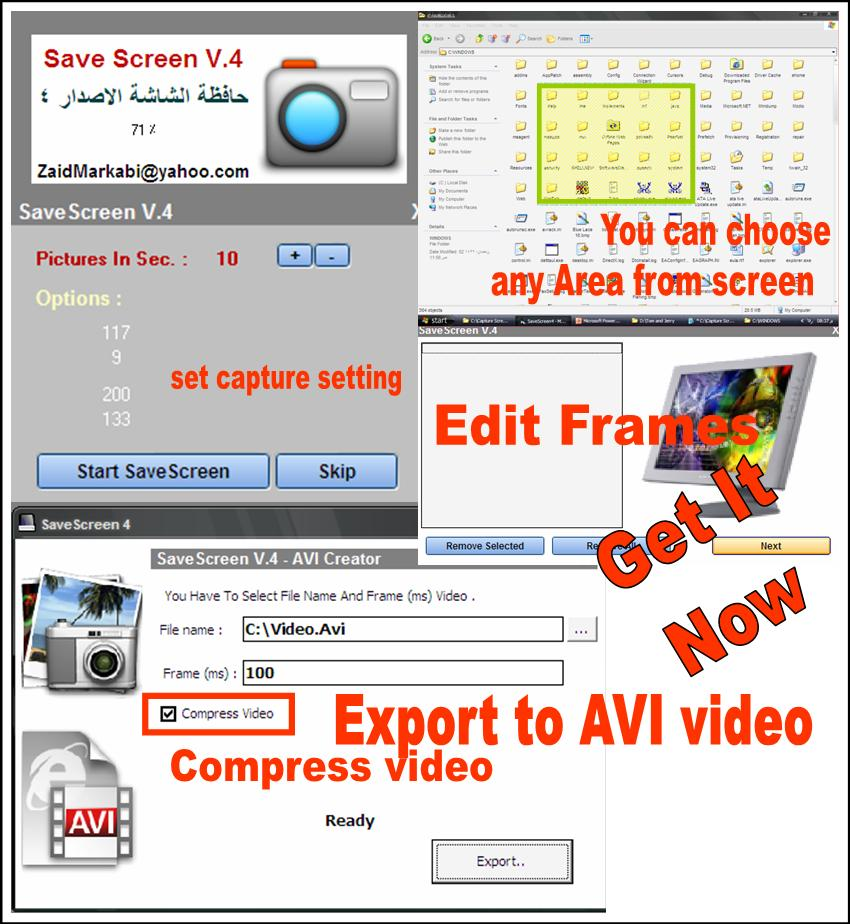



## Save Screen Ver\.4

### Description

Capture the screen to compressed AVI video file, WithOUT any Dll or Ocx file, choose area from screen to save it as video file.

You can edit frames after capturing !!

It's really powerful and easy to use, choose part of screen , capture the screen , choose output file!

See screenshot and get it now...

Email :

zaidmarkabi@yahoo.com

I hope to hear from you soon,

Webpage :

http://yazanmarkabi.jeeran.com/allmembers/zaid%20markabi.html
 
### More Info
 

             |
---                |---
**Submitted On**   |2008-09-27 20:52:58
**By**             |[Zaid Markabi](https://github.com/Planet-Source-Code/PSCIndex/blob/master/ByAuthor/zaid-markabi.md)
**Level**          |Advanced
**User Rating**    |4.8 (24 globes from 5 users)
**Compatibility**  |VB 5\.0, VB 6\.0
**Category**       |[Complete Applications](https://github.com/Planet-Source-Code/PSCIndex/blob/master/ByCategory/complete-applications__1-27.md)
**World**          |[Visual Basic](https://github.com/Planet-Source-Code/PSCIndex/blob/master/ByWorld/visual-basic.md)
**Archive File**   |[Save\_Scree2128619282008\.zip](https://github.com/Planet-Source-Code/zaid-markabi-save-screen-ver-4__1-71141/archive/master.zip)

